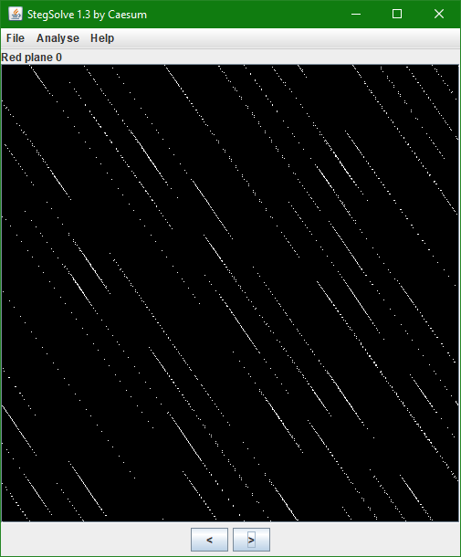
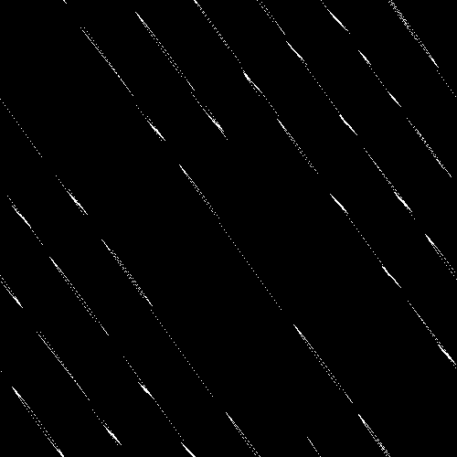
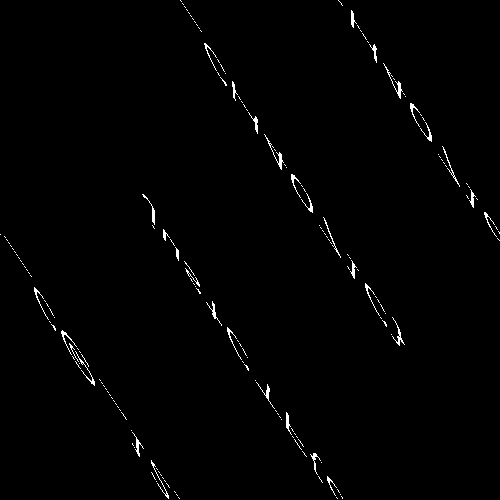

# catto

"Easy" stegano challenge combining LSB stego with chaotic mapping ([Arnold's cat map](https://en.wikipedia.org/wiki/Arnold%27s_cat_map)) to obfuscate the data.

## Intended solution

We are given the `catto.png` file. Quick look in stegsolve reveals some type of scrambled data embeded in the LSB of the red channel.



`pngcheck` points us to the key piece of information:

```
$ pngcheck catto.png
catto.png  additional data after IEND chunk
ERROR: catto.png
```
```
$ xxd catto.png | tail -n 3
0005fcb0: 0000 4945 4e44 ae42 6082 2878 2c79 292d  ..IEND.B`.(x,y)-
0005fcc0: 3e28 322a 782b 792c 782b 7929 204d 4f44  >(2*x+y,x+y) MOD
0005fcd0: 204e 0a                                   N.
```

The formula `(x,y)->(2*x+y,x+y) MOD N` describes the aforementioned cat map, which shuffles the pixels around. `N` refers to the size of the image (which was 500x500 - `N = 500`), `MOD N` means element-wise modulo of the coordinates (`(x,y) mod n = (x mod n, y mod n)`), essentially wrapping around the image.
[Applying it](private/catmap.py) to the extracted hidden data three times gradually deobfuscates the original image:





### Why it works

The image containing flag has been mapped 297 times, then embedded in the cat picture. For an image of this size, the cat map cancels itself out after 300 iterations, therefore applying the transformation 3 more times is equivalent to reversing it 297 times.

## Postmortem

Unfortunately, after the first two, the solves stopped coming. After a while I decided to investigate what went wrong. I couldn't find the error, therefore decided to write a different solver script from scratch, which revealed the fatal flaw. Compare the following two snippets of code, from the [original solver](private/catmap.py) and the [second one](solve/lsb_and_cat.py):

```python
im = array(Image.open(f_in))
N = im.shape[0]

x,y = numpy.meshgrid(range(N),range(N))
xmap = (2*x+y) % N
ymap = (x+y) % N
```
```python
def catmap(x,y, n):
	return ((x+y) % n, (2*x+y) % n)
```

As you can probably tell, the scripts use different coordinate systems. This is because PIL stores the image using the `yx` order, therefore the `numpy` transformation operated on a transposed image. `Image.fromarray` method actually takes this into consideration, which is why I didn't notice any anomalies. This discrepancy prevented the vast majority of teams from finding the flag, essentially turning this chall into a guessing game.

### Main takeaway:
* Don't use the same script for generating and solving challenges.


