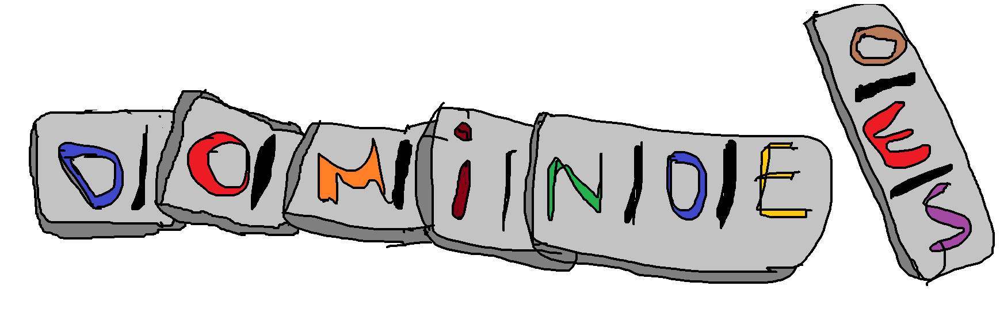

### Dominoes

I found a very old set of dominoes:  
- [puzzles.txt](public/puzzles.txt)

The hidden inscription scrapped on the box says: 
> The truth split into the pieces is the key.  
> But remember, there is only one true truth!

I suspect the key to be a *semantically correct* and *meaningful* sentence consisted of *lowercase english words* only. Can you help me uncover the key?

**The flag is the recovered sentence wrapped into `justCTF{}` format**.  
   
Author *terjanq*