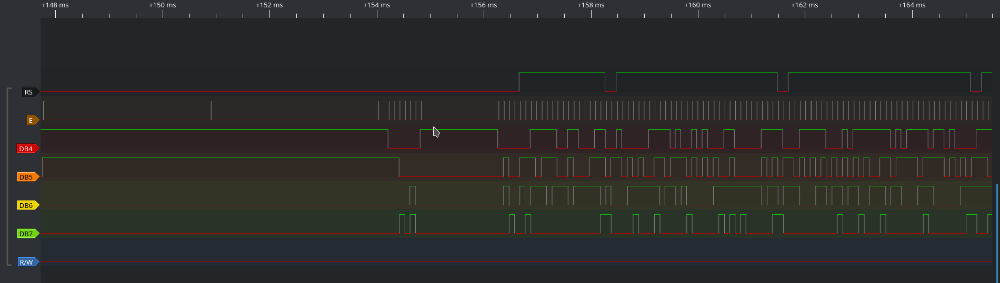
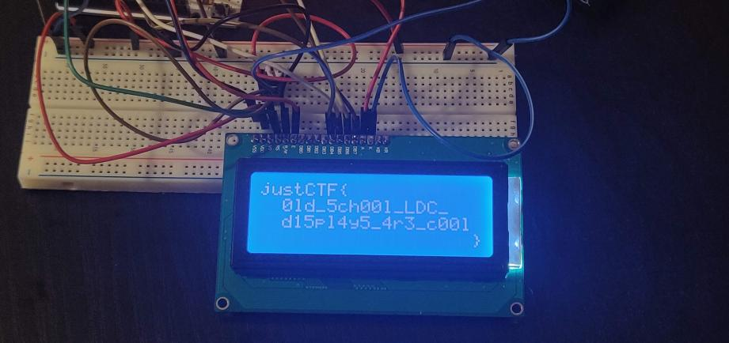

# Wierd signals

Task contains [***csv file***](public/wierd_signals.jpg) with recording of logical state analyzer connected to a LCD 20x4 display. The soft from the analyzer software looks like this:

The LCD display shows the flag: 

So the users need to parse the file properly to retrieve it.
